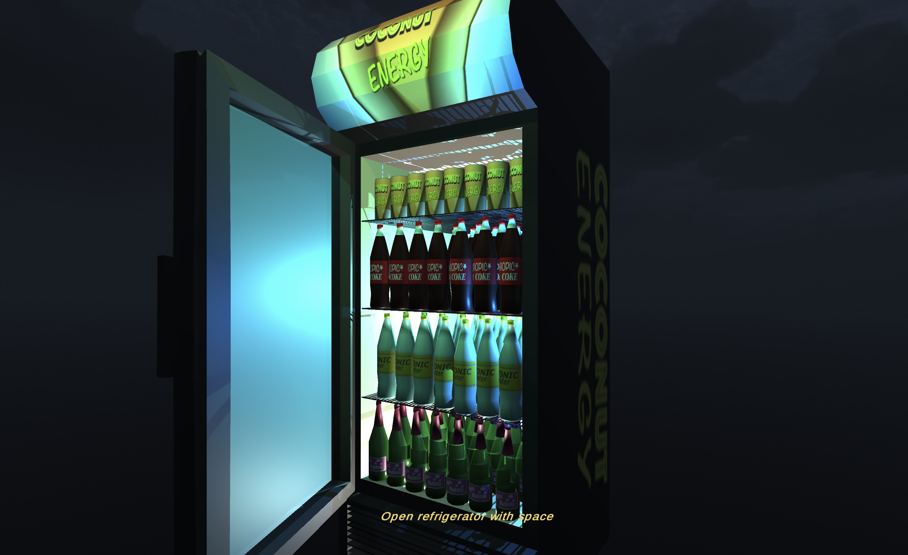
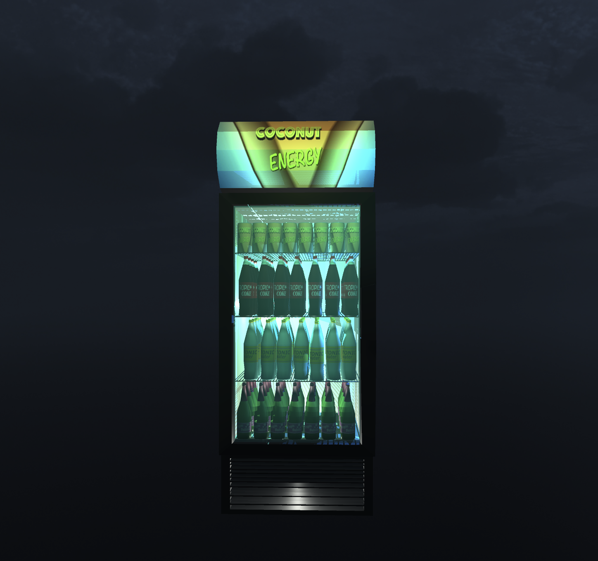
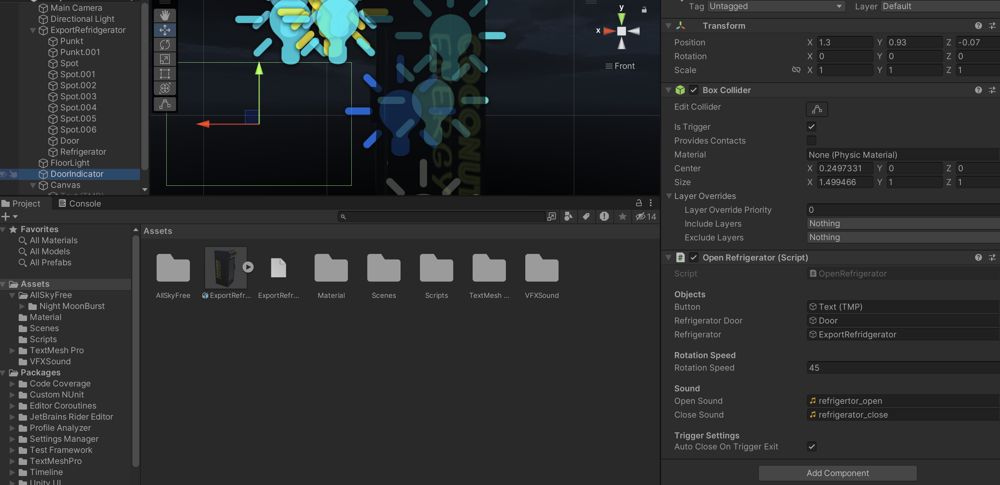

# Refrigerator
### Simple Refrigerator Asset for Unity

This is a simple Unity-Asset created in Blender. You are free to download and use it. For the scene a
simple script is added that moves the cam with the the arrow keys, so you can walk a little around.
I added a free night skybox to show of the lighning effects.

I also added a Indicator GameObjekt. If you trigger it by walking near the refrigerator, you can open and close
door by pressing the space bar.

  
  

You can simple change the opening-/closing speed in the Inspector. The door will close automaticly if you leave the
trigger section by default. You can turn that off at the inspector.

